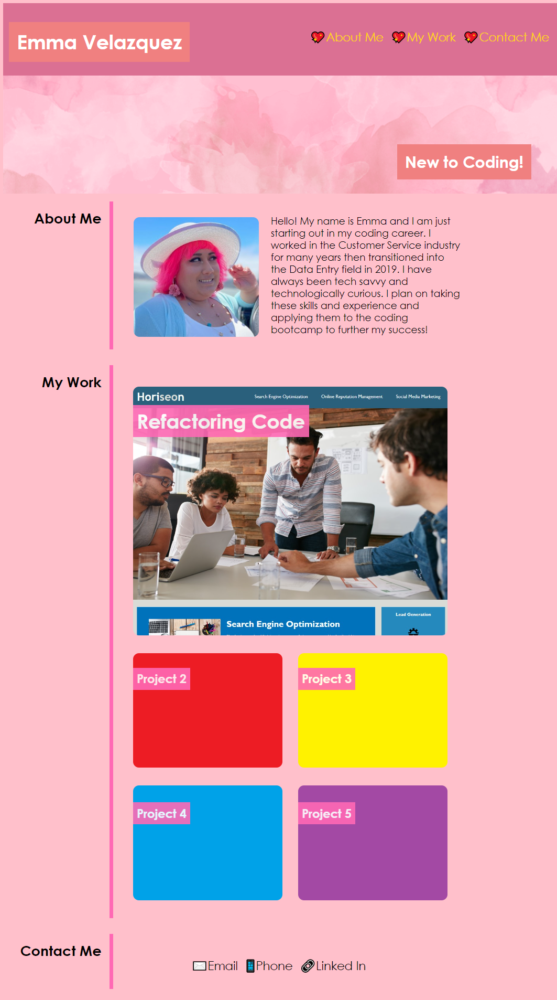
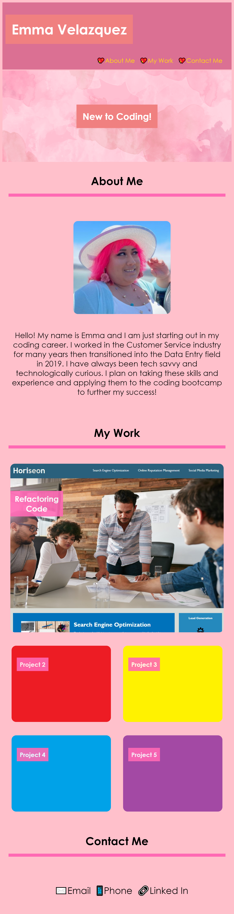
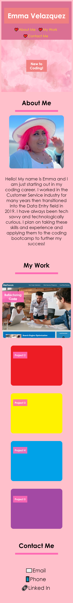

# <Web-Developer-Portfolio>
# Web Developer Portfolio

## Description

This project served as the beginning of my professional portfolio for web development. There was no starter code for this assignment which proved much more difficult than refactoring. The website built for this project was to display my bio, work, and contact information. Each link in the header navigation should direct the user to the corresponding section on the website. The Contact Me navigation should link to corresponding ways to get in contact with me. Once all HTML and CSS code were set, a second and third CSS style sheet were created to adapt the layout to various viewport sizes. The project images should all grow and have a border glow when hovering over them. Lastly, when a project image is clicked the user will be taken to the deployed application in a new tab in their browser.

---
## Usage

To view the website application please follow the provided link:
https://emmasiren.github.io/Web-Developer-Portfolio/

The following image shows the web application when loaded correctly at 1440px width for a Large Laptop screen. 

The following image shows the web application loaded at 426px - 768px width for a Tablet screen. 

The following image shows the web application loaded at 425px width for a Large Mobile Phone screen. 

